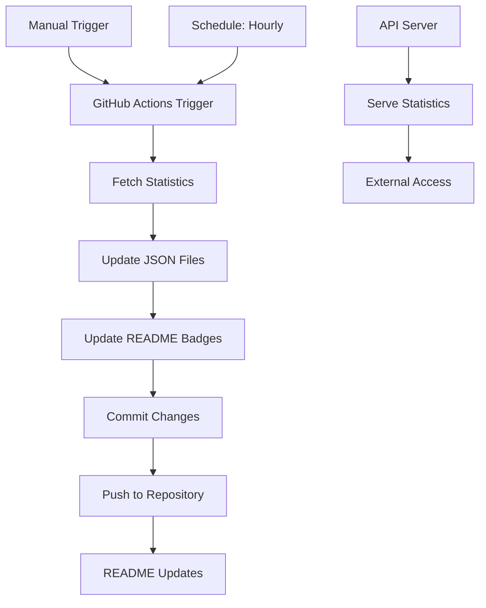

# Gaza Genocide Documentation - Project Structure

## 📁 Complete Project Structure

```
gaza-genocide-documentation/
├── README.md                          # Main documentation with dynamic badges
├── CONTRIBUTING.md                    # Contribution guidelines
├── PROJECT_STRUCTURE.md               # This file - project documentation
├── requirements.txt                   # Python dependencies
├── vercel.json                       # Vercel deployment configuration
├── .github/workflows/
│   └── update-stats.yml              # GitHub Actions for hourly updates
├── scripts/
│   ├── fetch_statistics.py           # Main data fetching script
│   ├── update_badges.py              # Badge update script
│   └── api_server.py                 # Flask API server
└── data/
    ├── latest_stats.json             # Current statistics (auto-generated)
    ├── api_stats.json                # API endpoint data (auto-generated)
    └── sample_stats.json             # Sample data structure
```

## 🔧 Core Components

### 1. Data Fetching System (`fetch_statistics.py`)

**Purpose**: Fetches real-time statistics from verified sources

**Key Features**:
- Fetches from Gaza Ministry of Health, UN OCHA, WHO
- Web scraping from official sources
- Error handling and fallback mechanisms
- Calculates daily increases based on trends
- Cross-references multiple sources

**Data Sources**:
- Gaza Ministry of Health official reports
- UN OCHA Gaza Flash Updates
- WHO Gaza Health Situation reports
- International humanitarian organizations

### 2. Badge Update System (`scripts/update_badges.py`)

**Purpose**: Updates README badges with latest statistics

**Key Features**:
- Reads JSON data and creates shield.io badges
- Updates README.md automatically
- Creates API endpoint for external access
- Handles URL encoding for special characters

**Badge Types**:
- Death Toll (red)
- Children Killed (orange)
- Women Killed (purple)
- Injured (yellow)
- Displaced (blue)
- Hospitals Operational (green)
- Last Updated (blue)

### 3. API Server (`scripts/api_server.py`)

**Purpose**: Serves statistics via REST API

**Endpoints**:
- `/` - API information
- `/stats` - Complete statistics
- `/badges` - Badge-formatted data
- `/health` - Health check
- `/data/<filename>` - Serve data files

**Deployment Options**:
- Vercel (configured)
- Netlify
- Heroku
- GitHub Pages

### 4. GitHub Actions Workflow (`.github/workflows/update-stats.yml`)

**Purpose**: Automated hourly updates

**Schedule**: Runs every hour (`0 * * * *`)

**Steps**:
1. Checkout repository
2. Setup Python environment
3. Install dependencies
4. Fetch latest statistics
5. Update README badges
6. Commit and push changes

## 📊 Data Structure

### Statistics JSON Format

```json
{
  "total_deaths": "27,000+",
  "children_deaths": "11,500+",
  "women_deaths": "8,000+",
  "total_injured": "66,000+",
  "displaced_people": "1.9M+",
  "operational_hospitals": "15/36",
  "last_updated": "2024-01-08 09:07 UTC",
  "fetch_timestamp": "2024-01-08T09:07:00.000000",
  "sources": ["Gaza Ministry of Health", "UN OCHA", "WHO"],
  "update_frequency": "hourly",
  "data_verification": "cross-referenced"
}
```

## 🚀 Deployment Options

### Option 1: GitHub Only (Recommended)
- Repository runs entirely on GitHub
- GitHub Actions handles automation
- GitHub Pages serves static files
- Zero hosting costs

### Option 2: GitHub + API Server
- GitHub for documentation and automation
- Vercel/Netlify for API server
- Dynamic badges via API endpoints
- More real-time updates

### Option 3: Full API Deployment
- Deploy API server to cloud platform
- Use API for all dynamic content
- Maximum flexibility and real-time data

## 🔄 Automation Flow



## 📈 Current Statistics (as of 2024-01-08)

### Death Toll
- **Total Deaths**: 27,000+
- **Children**: 11,500+
- **Women**: 8,000+
- **Injured**: 66,000+

### Humanitarian Crisis
- **Displaced**: 1.9M+ (85% of population)
- **Food Insecurity**: 93%
- **Operational Hospitals**: 15/36
- **Starvation Deaths**: 25+

### Infrastructure
- **Hospitals Destroyed**: 23
- **Schools Destroyed**: 300+
- **Homes Destroyed**: 60,000+
- **Mosques Destroyed**: 200+

## 🛠️ Development Setup

### Prerequisites
- Python 3.8+
- Git
- GitHub account

### Local Development
```bash
# Clone repository
git clone https://github.com/your-username/gaza-genocide-documentation.git
cd gaza-genocide-documentation

# Install dependencies
pip install -r requirements.txt

# Test data fetching
python fetch_statistics.py

# Test badge updates
python scripts/update_badges.py

# Test API server (optional)
python scripts/api_server.py
```

### Testing
```bash
# Verify data structure
cat data/latest_stats.json

# Check badge updates
python scripts/update_badges.py

# Test API endpoints
curl http://localhost:5000/stats
```

## 🔍 Monitoring and Maintenance

### Health Checks
- GitHub Actions workflow status
- API server uptime
- Data source availability
- Badge update frequency

### Error Handling
- Fallback to cached data
- Multiple data source verification
- Graceful degradation
- Error logging and alerts

### Data Verification
- Cross-reference multiple sources
- Timestamp all updates
- Maintain source attribution
- Regular accuracy reviews

## 📞 Support and Contributing

### Getting Help
- GitHub Issues for bug reports
- CONTRIBUTING.md for guidelines
- Email: documentation@example.com

### Contributing
1. Fork the repository
2. Add verified sources only
3. Include proper citations
4. Submit pull request with evidence

### Translation
- Arabic version needed
- French version needed
- Spanish version needed
- Other languages welcome

---

**This project serves as a comprehensive, automated documentation system for the humanitarian crisis in Gaza, ensuring factual accuracy and real-time updates.** 